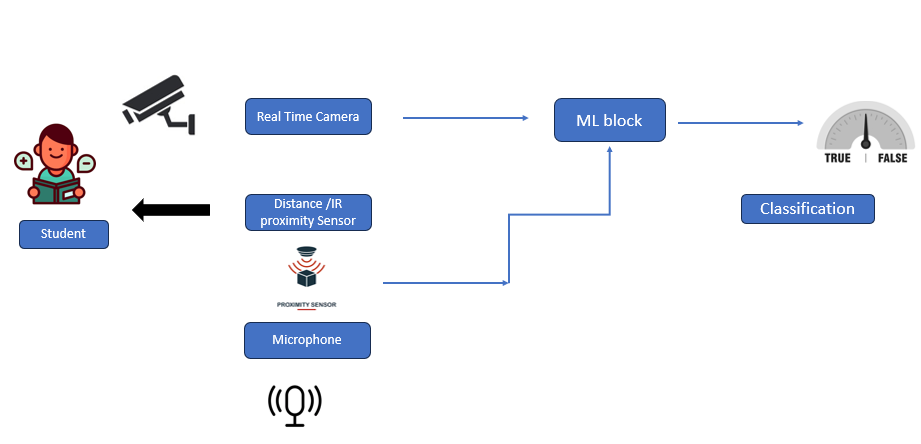

# Study_mointoring_Analysis

1. Define Functions:
    Define the mediapipe_detection function:
    Convert the image from BGR to RGB color space.
    Set the image as not writable.
    Process the image using the MediaPipe model to make predictions.
    Set the image as writable again.
    Convert the image back to the BGR color space.
    Return the processed image and the detection results.
    Define the draw_landmarks function:
    Draw landmarks for the face, pose, left hand, and right hand on the image using MediaPipe's drawing utilities.
    
2. Load and Process Image:
     Load an image using OpenCV (cv2.imread()).

3.  Perform Detection:
        Use the Holistic model from MediaPipe with specified confidence thresholds for detection and tracking.
        Call the mediapipe_detection function to process the image and obtain the detection results.
4.  Display Detected Landmarks:
        Draw landmarks on the original image using the draw_landmarks function.
        Display the image with landmarks using Matplotlib (plt.imshow()).

